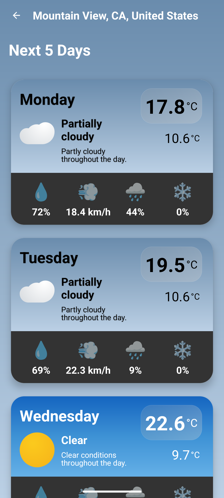

# WeatherNex: Modern Weather App for Android 🌦️


## 📋 Table of Contents

1. [Overview](#-the-smart-weather-companion)
2. [App Screenshots & UI Components](#-app-screenshots--ui-components)
3. [Features](#-features)
4. [Technical Architecture](#-technical-architecture)
5. [Project Structure & Components](#-project-structure--components)
6. [Technology Stack](#-technology-stack)
7. [Data Flow](#-data-flow)
8. [Testing Guide](#-testing-guide)
9. [Installation](#-installation)
10. [Core Components](#-core-components)
11. [Future Enhancements](#-future-enhancements)
12. [License & Credits](#-license)

## 📱 The Smart Weather Companion

WeatherNex is a sophisticated, user-friendly weather application designed to provide accurate, real-time weather information with a beautiful interface. With smart caching, offline mode, and detailed forecasts, Weathernaut keeps you prepared for all weather conditions.

**Developed by: [Fady Gerges](https://github.com/Fady2024)**

## 📸 App Screenshots & UI Components

### Main Weather Screen (MainActivity)
 

**File Location:** `app/src/main/java/com/example/weatherapp/ui/weather/MainActivity.kt`

**Key Components:**
- **Current Weather Display:** Shows temperature, conditions, and weather icon
- **Hourly Forecast Carousel:** Horizontal RecyclerView with hourly predictions
- **Weather Details Section:** Displays humidity, wind, pressure, UV index
- **Swipe-to-Refresh:** Updates data with pull-down gesture
- **Navigation Buttons:** Settings button, search button, location button
- **Offline Banner:** Appears when network is unavailable

**How to Navigate:**
1. Pull down to refresh weather data
2. Tap settings icon to adjust units and preferences
3. Tap search icon to find different locations
4. Tap location icon to get weather for current location
5. Swipe horizontally in hourly forecast to see upcoming hours
6. Tap "Next 5 Days" to view extended forecast

### Forecast Screen (ForecastActivity)


**File Location:** `app/src/main/java/com/example/weatherapp/ui/forecast/ForecastActivity.kt`

**Key Components:**
- **Location Header:** Displays current location name
- **5-Day Forecast List:** RecyclerView showing 5-day weather predictions
- **Forecast Item Details:** Day, temperature high/low, conditions, humidity, wind
- **Back Button:** Returns to main screen
- **Weather Icons:** Visual representations of forecast conditions

**How to Access:**
From the main screen, tap "Next 5 Days" to view the 5-day forecast.

### Search Screen (SearchLocationActivity)


**File Location:** `app/src/main/java/com/example/weatherapp/ui/search/SearchLocationActivity.kt`

**Key Components:**
- **Search Input:** EditText for location queries
- **Search History:** RecyclerView of previous searches
- **Current Location Option:** Uses device GPS for weather
- **Clear History Button:** Erases search history
- **Cancel Button:** Returns to previous screen

**How to Use:**
1. Tap the search icon on main screen
2. Type a location name and press search
3. Tap on previous search items to quickly access
4. Tap "Current Location" to use GPS coordinates
5. Swipe to remove items from history

### Settings Screen (SettingsActivity)


**File Location:** `app/src/main/java/com/example/weatherapp/ui/settings/SettingsActivity.kt`

**Key Components:**
- **Temperature Unit Selector:** Choose between Celsius and Fahrenheit
- **Wind Speed Unit Selector:** Choose between m/s, km/h, and mph
- **Pressure Unit Selector:** Choose between atm, hPa, and inHg
- **Time Format Selector:** Choose between 12h and 24h formats
- **Animated Dropdowns:** Custom dropdowns with animations

**How to Access:**
From the main screen, tap the settings (gear) icon to access preferences.

### Splash Screen (SplashActivity)


**File Location:** `app/src/main/java/com/example/weatherapp/ui/splash/SplashActivity.kt`

**Key Components:**
- **App Logo:** Weather app logo with animations
- **Loading Indicator:** Shows data loading progress
- **Status Messages:** Displays current loading operation

**Functionality:**
- Requests location permissions if needed
- Preloads weather data for current/default location
- Checks network status and prepares cache
- Automatically navigates to main screen when ready

## ✨ Features

- **Real-time Weather Data** - Current conditions displayed beautifully
- **5-Day Forecast** - Plan ahead with accurate daily predictions
- **Hourly Forecasts** - Detailed hourly weather breakdowns
- **Location Search** - Find weather for any location worldwide
- **Smart Caching** - Access weather data even when offline
- **Customizable Units** - Choose between metric and imperial measurements
- **Weather Animations** - Visual representations of different weather conditions
- **UV Index & Details** - Comprehensive weather information including UV index, pressure, humidity, wind direction
- **Light & Dark Mode** - Comfortable viewing in any lighting condition
- **Automatic Location** - Get weather for your current location
- **Search History** - Quickly access previously searched locations
- **Offline Support** - Complete functionality even without internet connection
- **Swipe to Refresh** - Update weather data with a simple swipe gesture

## 📊 Technical Architecture

WeatherNex follows a presenter-first MVP (Model-View-Presenter) architecture for a clean, maintainable codebase:

- **Model**: Data classes for weather information, with immutable data structures
- **View**: Activities and adapters for displaying information, following a single-responsibility principle
- **Presenter**: Business logic handlers that orchestrate data flow and state management
- **Service Locator Pattern**: For dependency injection and better testability
- **Repository Pattern**: For data management with separation of concerns

## 📂 Project Structure & Components

### Base Package
**Location:** `app/src/main/java/com/example/weatherapp/base/`

Contains base interfaces that define the contract between Views and Presenters:

- **BasePresenter.kt**
  - Defines common presenter methods: `attachView()`, `detachView()`, `isViewAttached()`
  - Enables type-safe presenter implementation with generic View type
  - Manages view lifecycle and prevents memory leaks

- **BaseView.kt**
  - Defines common view methods: `showLoading()`, `hideLoading()`, `showError()`, etc.
  - Provides consistent UI state management across screens
  - Handles common UI patterns like loading states and error displays

### Dependency Injection Package
**Location:** `app/src/main/java/com/example/weatherapp/di/`

Implements a lightweight dependency injection system:

- **ServiceLocator.kt**
  - Provides singleton instances of services throughout the app
  - Initializes and manages dependencies with proper lifecycle
  - Offers accessor methods for repositories, managers, and presenters

### Model Package
**Location:** `app/src/main/java/com/example/weatherapp/model/`

Contains data models that represent weather information:

- **CurrentWeather.kt**
  - Represents current weather conditions
  - Includes temperature, conditions, humidity, wind, etc.

- **ForecastData.kt**
  - Represents daily forecast information
  - Includes high/low temps, conditions, precipitation, etc.

- **HourlyForecast.kt**
  - Represents hourly forecast information
  - Includes timestamps and hourly conditions

- **WeatherData.kt**
  - Comprehensive weather data model
  - Combines current and forecast data with additional details

- **LocationData.kt**
  - Represents geographic coordinates
  - Used for location-based weather queries

- **SearchHistoryItem.kt**
  - Represents a saved search history entry
  - Tracks location names and selection status

### Network Package
**Location:** `app/src/main/java/com/example/weatherapp/network/`

Handles API communication and data retrieval:

- **WeatherRepository.kt**
  - Central component for fetching weather data
  - Abstracts API communication details
  - Provides fallback to cached data when offline
  - Handles location name resolution from coordinates

### UI Package
**Location:** `app/src/main/java/com/example/weatherapp/ui/`

Contains all the user interface components, organized by feature:

- **weather/** - Main weather screen
  - **MainActivity.kt** - Primary app screen
  - **WeatherPresenter.kt** - Business logic for weather data
  - **WeatherContract.kt** - Interface between view and presenter
  - **adapter/HourlyForecastAdapter.kt** - Adapter for hourly forecast display

- **forecast/** - 5-day forecast screen
  - **ForecastActivity.kt** - Forecast display screen
  - **ForecastPresenter.kt** - Business logic for forecast data
  - **ForecastContract.kt** - Interface for forecast feature
  - **adapter/ForecastAdapter.kt** - Adapter for daily forecast items

- **search/** - Location search feature
  - **SearchLocationActivity.kt** - Search interface
  - **SearchLocationAdapter.kt** - Adapter for search results and history

- **settings/** - App preferences
  - **SettingsActivity.kt** - Settings UI
  - **SettingsPresenter.kt** - Settings business logic
  - **SettingsContract.kt** - Interface for settings management

- **splash/** - App loading screen
  - **SplashActivity.kt** - Initial loading experience

### Util Package
**Location:** `app/src/main/java/com/example/weatherapp/util/`

Contains utility classes that provide cross-cutting functionality:

- **CacheManager.kt**
  - Handles caching of weather data
  - Implements sophisticated cache invalidation logic
  - Provides typed cache results with error handling

- **ErrorHandler.kt**
  - Centralizes error management
  - Converts exceptions to user-friendly messages
  - Categorizes errors for appropriate UI responses

- **NetworkManager.kt**
  - Detects network connectivity
  - Validates internet access
  - Notifies components of connectivity changes

- **Settings.kt**
  - Manages user preferences
  - Handles unit conversions (temperature, wind, pressure)
  - Provides consistent formatting for display

- **WeatherApi.kt**
  - Communicates with Visual Crossing weather API
  - Handles API requests and responses
  - Parses JSON data into model objects

- **WeatherIconMapper.kt**
  - Maps weather conditions to appropriate icons
  - Provides consistent visual representation of weather

- **WindDirectionConverter.kt**
  - Converts wind direction degrees to cardinal directions
  - Formats wind direction for display

## 🧪 Testing Guide

WeatherNex includes comprehensive testing capabilities:

### Running Unit Tests

Unit tests verify individual components in isolation:

```bash
# Run all unit tests
./gradlew test

# Run tests for a specific class
./gradlew test --tests "com.example.weatherapp.WeatherRepositoryTest"
```

### Key Unit Test Files

- **WeatherRepositoryTest.kt** - Tests the weather data repository
- **CacheManagerTest.kt** - Tests the caching mechanisms
- **SettingsTest.kt** - Tests the settings management and conversions

### Running Instrumentation Tests

Instrumentation tests verify UI components and interactions:

```bash
# Connect a device or start an emulator first
./gradlew connectedAndroidTest
```

### Key Instrumentation Test Files

- **MainActivityTest.kt** - Tests the main weather screen UI
  ```kotlin
  @Test
  fun testWeatherDataDisplayed() {
      // Launch MainActivity
      ActivityScenario.launch(MainActivity::class.java)
      
      // Verify that main weather elements are displayed
      onView(withId(R.id.textViewTemperature)).check(matches(isDisplayed()))
      onView(withId(R.id.textViewLocation)).check(matches(isDisplayed()))
      onView(withId(R.id.textViewWeatherDescription)).check(matches(isDisplayed()))
  }
  ```

- **PerformanceTest.kt** - Verifies app performance metrics
  ```kotlin
  @Test
  fun testCacheReadPerformance() {
      val readTime = measureTimeMillis {
          repeat(100) {
              cacheManager.getCurrentWeather()
          }
      }
      
      // Read time should be less than 500ms for 100 operations
      assert(readTime < 500) { "Cache read performance is too slow: $readTime ms" }
  }
  ```

### Creating Your Own Tests

To create a new unit test:
1. Navigate to `app/src/test/java/com/example/weatherapp/`
2. Create a new Kotlin file (e.g., `MyComponentTest.kt`)
3. Use JUnit annotations (@Test, @Before, etc.)
4. Run with `./gradlew test`

To create a new instrumentation test:
1. Navigate to `app/src/androidTest/java/com/example/weatherapp/`
2. Create a new Kotlin file (e.g., `MyUITest.kt`)
3. Use AndroidX Test libraries and Espresso
4. Run with a connected device or emulator

## 🛠️ Technology Stack

- **Kotlin** - 100% Kotlin for modern Android development with coroutines for asynchronous operations
- **Android SDK** - Targeting the latest Android versions with backward compatibility to API 21
- **Visual Crossing API** - Reliable weather data source with comprehensive weather information
- **SharedPreferences** - For caching and settings persistence with custom serialization
- **RecyclerView** - For efficient list rendering with custom view holders and animations
- **SwipeRefreshLayout** - For pull-to-refresh functionality with custom color schemes
- **Custom Animations** - For smooth user experience including transitions and loading indicators
- **Constraint Layouts** - For flexible, responsive UI that adapts to different screen sizes
- **Multi-threading** - For responsive network operations and background tasks
- **Custom View Components** - For specialized weather displays and visualizations
- **Geocoding** - For location name resolution and coordinates conversion
- **Android Location Services** - For current location detection
- **Custom Error Handling** - Centralized error management with user-friendly messages

## 🔄 Data Flow

1. **Request Stage**: App requests weather data from Visual Crossing API
   - Checks network connectivity first
   - Uses appropriate API endpoints for current weather vs forecast
   - Handles authentication and request parameters

2. **Processing Stage**: Data is parsed and transformed into app models
   - JSON parsing with error handling
   - Data validation and normalization
   - Mapping to domain-specific models

3. **Caching Stage**: Weather information is cached for offline access
   - Serialization of data models to JSON
   - Timestamp-based cache invalidation
   - Sophisticated cache result handling

4. **Presentation Stage**: Data is displayed through the UI components
   - MVP pattern for separation of concerns
   - State management in presenters
   - Reactive UI updates

## ⚙️ Installation

1. Clone the repository
   ```bash
   git clone https://github.com/Fady2024/weatherapp.git
   ```

2. Open the project in Android Studio

3. Add your Visual Crossing API key in `.env` file (create one if not present)
   ```
   WEATHER_API_KEY=your_api_key_here
   ```

4. Build and run the app on your device or emulator
   ```bash
   ./gradlew assembleDebug
   ```

## 🧩 Core Components

### Weather Repository

Central component for fetching and managing weather data:

```kotlin
/**
 * Fetches current weather data for the specified location.
 * If offline, returns cached data if available and not expired.
 * @param location The location to fetch weather for (city name or coordinates)
 * @return WeatherData object containing current weather information
 * @throws IOException if there's a network error and no cache is available
 */
fun fetchWeather(location: String): WeatherData {
    return try {
        if (isNetworkAvailable()) {
            Log.d(TAG, "Fetching weather data from API for $location")
            val jsonResponse = WeatherApi.fetchWeather(location)
            val weatherData = WeatherApi.parseWeatherData(jsonResponse)
            cacheManager.saveCurrentWeather(weatherData)
            weatherData
        } else {
            Log.d(TAG, "No network available, trying to get cached weather data")
            cacheManager.getCurrentWeather()?.also {
                Log.d(TAG, "Using cached weather data for ${it.location}")
            } ?: throw IOException("No network connection and no cached data available")
        }
    } catch (e: Exception) {
        Log.e(TAG, "Error fetching weather data", e)
        cacheManager.getCurrentWeather()?.also {
            Log.d(TAG, "Using cached weather data as fallback")
        } ?: throw e
    }
}
```

### Cache Manager

Sophisticated caching system for offline functionality with robust error handling:

```kotlin
/**
 * Sealed class representing the possible outcomes of a cache operation
 */
sealed class CacheResult<out T> {
    data class Success<T>(val data: T, val timestamp: String) : CacheResult<T>()
    data class Expired(val timestamp: String) : CacheResult<Nothing>()
    class NotFound : CacheResult<Nothing>()
    data class Error(val exception: Exception) : CacheResult<Nothing>()
}

/**
 * Saves current weather data to cache
 * @param weatherData The weather data to cache
 */
fun saveCurrentWeather(weatherData: WeatherData) {
    try {
        val jsonObject = JSONObject().apply {
            put("temperature", weatherData.temperature)
            put("conditions", weatherData.conditions)
            put("humidity", weatherData.humidity)
            // More properties serialized...
        }
        
        val timestamp = System.currentTimeMillis()
        prefs.edit()
            .putString(KEY_CURRENT_WEATHER, jsonObject.toString())
            .putLong(KEY_LAST_UPDATE, timestamp)
            .apply()
        
        Log.d(TAG, "Weather data cached at ${dateFormat.format(Date(timestamp))}")
    } catch (e: JSONException) {
        Log.e(TAG, "Error saving weather to cache", e)
    }
}
```

### Service Locator

Dependency injection system to provide singleton instances throughout the app:

```kotlin
/**
 * Service Locator pattern implementation for dependency injection
 * Provides singleton instances of dependencies throughout the app
 */
object ServiceLocator {
    private var instance: ServiceLocator? = null
    private var applicationContext: Context? = null

    // Lazy initialized dependencies
    private lateinit var networkManager: NetworkManager
    private lateinit var cacheManager: CacheManager
    private lateinit var weatherRepository: WeatherRepository
    private lateinit var searchHistoryManager: SearchHistoryManager

    fun init(context: Context) {
        applicationContext = context.applicationContext
        networkManager = NetworkManager(context)
        cacheManager = CacheManager(context)
        weatherRepository = WeatherRepository(context)
        searchHistoryManager = SearchHistoryManager(context)
    }

    fun provideWeatherPresenter(): WeatherPresenter {
        checkInit()
        return WeatherPresenter(
            weatherRepository = weatherRepository,
            networkManager = networkManager,
            cacheManager = cacheManager
        )
    }
    
    // More provider methods...
}
```

### Main Activity

The core UI component displaying current weather with comprehensive details:

```kotlin
override fun onCreate(savedInstanceState: Bundle?) {
    super.onCreate(savedInstanceState)
    setContentView(R.layout.activity_main)
    
    try {
        // Initialize dependencies from ServiceLocator
        weatherRepository = ServiceLocator.provideWeatherRepository()
        cacheManager = ServiceLocator.provideCacheManager()
        networkManager = ServiceLocator.provideNetworkManager()
        errorHandler = (application as WeatherApplication).errorHandler
        
        // Initialize UI components
        initializeViews()
        setupListeners()
        
        // Load weather data for selected location
        currentLocation = intent.getStringExtra("LOCATION") 
            ?: getString(R.string.default_location)
        
        loadWeatherData()
        
        // Show offline banner if needed
        if (!networkManager.isNetworkAvailable()) {
            showOfflineBanner()
        }
    } catch (e: Exception) {
        Log.e(TAG, "Error initializing MainActivity", e)
        Toast.makeText(this, getString(R.string.error_general), 
            Toast.LENGTH_LONG).show()
        finish()
    }
}
```

## 🚀 Future Enhancements

- **Weather Widgets** - Add home screen widgets for quick access to weather information
- **Weather Alerts** - Push notifications for severe weather warnings and alerts
- **Weather Maps** - Interactive weather maps showing precipitation, temperature, and wind patterns
- **Multi-language Support** - Internationalization for global users with locale-specific formatting
- **Weather History** - Historical weather data visualization and trends analysis
- **Voice Control** - Integration with voice assistants for hands-free operation
- **Wear OS Support** - Companion app for smartwatches showing essential weather information
- **Weather-based Recommendations** - Activity suggestions based on current and forecast weather
- **Air Quality Index** - Adding air quality measurements and health recommendations
- **Pollen Count** - Allergy information and forecasts for sensitive individuals

## 📄 License

Copyright © 2023 Fady Gerges. All rights reserved.

## 🔗 Credits

- **Developer**: [Fady Gerges](https://github.com/Fady2024)
- Weather data provided by [Visual Crossing Weather API](https://www.visualcrossing.com/)


---

<p align="center">⛅ WeatherNex - Always be Weather-Ready ⛅</p>
